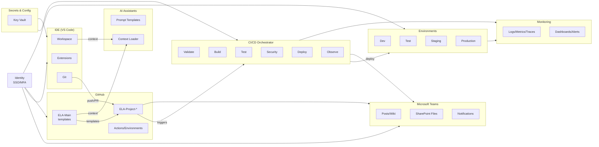

## Metadata
---
Artifact_ID: DOC-00-Systems_Integration_
Artifact_Name: 0. Metadata
Artifact_Type: DOC
Comments: Auto-generated on 2025-10-25
Dependencies: None
Derived_From: 
Description: 0. Metadata
File_Path: 00_Policy/Systems_Integration_Blueprint.md
Filled_By: 
GitHub_URL: https://github.com/EhsanLasani/ELA-Main/blob/main/00_Policy/Systems_Integration_Blueprint.md
Last_Updated: 2025-10-25
Owner: Enterprise Architecture Office (EAO)
Phase: Policy
Process_Group: Policy
Process_Step: N/A
Project_Name: 
Status: Draft
Template_Source: 
Validation_Status: Pending
Version: v1.0
---
# 0. Metadata

- **Artifact ID (catalog.csv):** DOC-POL-SYSTEMS-INTE
- **Version:** v2.0
- **Owner:** Enterprise Architecture Office (EAO)
- **Effective Date:** 2025-10-23
- **Review Cycle:** Quarterly
- **Linked Ticket / PR:**

## 1. Provisioning and Workspace Automation

### 1.1 Automated Project Initialization

**Trigger:** New ELA project registration

**Automation Tool:** PowerShell scripts, Azure Logic Apps, or GitHub Actions

**Provisioned Resources:**
- **MS Teams:** Private channel under ELA Hub Team
- **GitHub:** Repository cloned from ELA-Main template with branch protection rules
- **Project Board:** Azure DevOps, Jira, or GitHub Projects with default workflows
- **SharePoint:** Document library linked to Teams channel
- **Environments:** Dev, Test, Staging, Production with appropriate access controls
- **Secrets:** Initial service principals, connection strings stored in Key Vault
- **Monitoring:** Default dashboards and alert rules

**Outputs:**
- Project ID
- Teams channel link
- GitHub repository URL
- Environment URLs
- Initial documentation

### 1.2 Identity and Access Management

**Identity Provider:** Azure Entra ID (formerly Azure AD), Okta, or corporate SSO

**Access Control:**
- **Role-Based Access Control (RBAC):** Mapped across all platforms
- **Least Privilege:** Users granted minimum required permissions
- **Multi-Factor Authentication (MFA):** Required for all environments
- **Conditional Access:** Based on device compliance, location, risk level

**Service Principals:**
- Managed identities for Azure resources
- Service accounts with rotated secrets for GitHub Actions, CI/CD pipelines

## 3. Branching Strategy and Release Management

### 3.1 GitFlow or Trunk-Based Development

**GitFlow (recommended for complex projects):**
- `main`: Production releases
- `develop`: Integration branch
- `feature/*`: New features
- `release/*`: Release candidates
- `hotfix/*`: Production fixes

**Trunk-Based (recommended for high-velocity teams):**
- `main`: Always deployable
- Short-lived feature branches (< 2 days)
- Feature flags for incomplete work

### 3.2 Semantic Versioning and Tagging

**Format:** `v{MAJOR}.{MINOR}.{PATCH}`

Example: v2.1.3

**Changelog:**
- Auto-generated from Conventional Commits
- Published with each release

## 5. Secrets Management and Configuration

### 5.1 Centralized Secrets Vault

**Tools:** Azure Key Vault, AWS Secrets Manager, HashiCorp Vault

**Integration Points:**
- IDEs: Plugins to fetch secrets locally (never commit)
- CI/CD: Pipelines fetch secrets at runtime
- Applications: Managed identities or service principals retrieve secrets

**Secret Rotation:**
- Automatic rotation schedules (e.g., 90 days)
- Alerts for expiring secrets
- Audit logs for all access

### 5.2 Configuration Management

**Environment-Specific Config:**
- Use configuration files per environment (dev.json, prod.json)
- Never hardcode environment-specific values

**Feature Flags:**
- LaunchDarkly, Azure App Configuration, or custom solution
- Enable/disable features without redeployment

## 7. Observability and Monitoring

### 7.1 Logging, Metrics, Tracing

**Logging:**
- Structured logs (JSON format)
- Centralized aggregation (Azure Log Analytics, ELK, Splunk)
- Log levels: DEBUG, INFO, WARN, ERROR, FATAL
- Correlation IDs for request tracing

**Metrics:**
- Application metrics (response time, throughput, error rate)
- Infrastructure metrics (CPU, memory, disk, network)
- Business metrics (transactions, conversions, active users)

**Tracing:**
- OpenTelemetry instrumentation
- Distributed tracing (Jaeger, Zipkin, Azure Application Insights)

### 7.2 SLO and Error Budgets

**SLO Examples:**
- Availability: 99.9% uptime
- Latency: p95 < 200ms
- Error Rate: < 0.1%

**Error Budget:**
- Calculated monthly
- If budget exhausted, halt new features and focus on reliability

### 7.3 Dashboards and Alerts

**Dashboards:**
- Golden signals: Latency, Traffic, Errors, Saturation
- Business KPIs
- Infrastructure health

**Alerting:**
- Based on SLO violations
- Tiered escalation: Team → Manager → On-Call
- Runbooks linked to each alert

## 9. Disaster Recovery and Business Continuity

### 9.1 Backup and Recovery

**Backup Strategy:**
- Database: Daily full backups + hourly incrementals
- Code: Version-controlled in GitHub with off-site replicas
- Configuration: Stored in version control and backed up vaults

**RTO/RPO Targets:**
- Critical systems: RTO < 1 hour, RPO < 15 minutes
- Standard systems: RTO < 4 hours, RPO < 1 hour

### 9.2 Runbooks and Playbooks

**Incident Response:**
- Detection → Triage → Mitigation → Resolution → Post-Mortem

**Runbook Contents:**
- Service description
- Common issues and fixes
- Escalation contacts
- Rollback procedures

**DR Drills:**
- Conduct at least annually
- Document lessons learned
- Update runbooks based on findings

-----------|-------|-----------|-------------|----------|-------------------|
| **Access Control** | CC6.1 | A.9.1.1 | AC-2 | N/A | Azure AD logs, GitHub audit |
| **Change Management** | CC8.1 | A.12.1.2 | CM-3 | N/A | GitHub PRs, CAB minutes |
| **Vulnerability Mgmt** | CC7.1 | A.12.6.1 | RA-5 | N/A | Snyk reports, SAST findings |
| **Backup/Recovery** | A1.2 | A.12.3.1 | CP-9 | N/A | Backup logs, DR test results |
| **Accessibility** | N/A | N/A | N/A | All | Axe reports, manual audits |

### 10.2 Automated Evidence Collection

- Pipeline logs stored for 2 years
- Audit logs exported to immutable storage
- Compliance reports generated monthly

## 12. Integration Flow Diagram (Mermaid)

------|------|-------------|--------|
| v1.0 | 2025-10-21 | Initial Release | EAO |
| v2.0 | 2025-10-23 | Enhanced with detailed provisioning, CI/CD stages, observability, compliance mapping, DR/BCP procedures, and AI integration | EAO |

---

**Document Control:**
- Maintained by Enterprise Architecture Office
- Reviewed quarterly
- Updates tracked via GitHub pull requests
