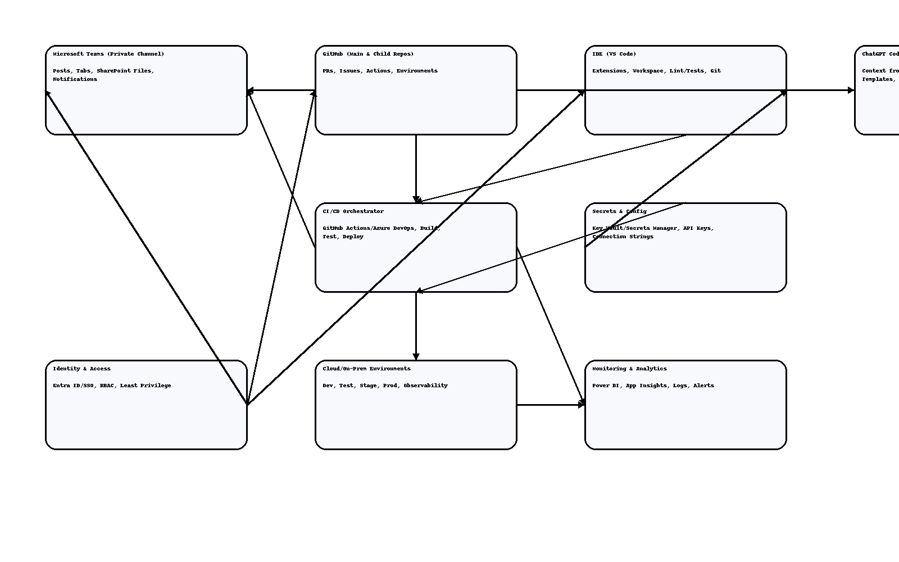

# 0. Metadata

- **Artifact ID (catalog.csv):** DOC-POL-SYSTEMS-INTE
- **Version:** v2.0
- **Owner:** Enterprise Architecture Office (EAO)
- **Effective Date:** 2025-10-23
- **Review Cycle:** Quarterly
- **Linked Ticket / PR:**

---

# ELA Systems Integration Blueprint

## Overview

This blueprint defines the technical architecture, integration patterns, and operational standards for how **MS Teams**, **GitHub**, **IDEs**, **CI/CD**, **Secrets Management**, **Cloud Environments**, **Monitoring**, and **Identity** interconnect to deliver Enterprise-Level Applications (ELAs).

**Date:** 2025-10-23



---

## 1. Provisioning and Workspace Automation

### 1.1 Automated Project Initialization

**Trigger:** New ELA project registration

**Automation Tool:** PowerShell scripts, Azure Logic Apps, or GitHub Actions

**Provisioned Resources:**
- **MS Teams:** Private channel under ELA Hub Team
- **GitHub:** Repository cloned from ELA-Main template with branch protection rules
- **Project Board:** Azure DevOps, Jira, or GitHub Projects with default workflows
- **SharePoint:** Document library linked to Teams channel
- **Environments:** Dev, Test, Staging, Production with appropriate access controls
- **Secrets:** Initial service principals, connection strings stored in Key Vault
- **Monitoring:** Default dashboards and alert rules

**Outputs:**
- Project ID
- Teams channel link
- GitHub repository URL
- Environment URLs
- Initial documentation

### 1.2 Identity and Access Management

**Identity Provider:** Azure Entra ID (formerly Azure AD), Okta, or corporate SSO

**Access Control:**
- **Role-Based Access Control (RBAC):** Mapped across all platforms
- **Least Privilege:** Users granted minimum required permissions
- **Multi-Factor Authentication (MFA):** Required for all environments
- **Conditional Access:** Based on device compliance, location, risk level

**Service Principals:**
- Managed identities for Azure resources
- Service accounts with rotated secrets for GitHub Actions, CI/CD pipelines

---

## 2. Repository Structure and Standards

### 2.1 ELA-Main Parent Repository

**Purpose:** Central template and shared asset repository

**Contents:**
- Policy documents
- Phase-specific templates (Definition, Design, Development, Testing, Deployment, Monitoring)
- Shared code libraries and utilities
- CI/CD pipeline templates
- Documentation templates
- Architecture diagrams and ADR templates

**Version Control:**
- Semantic versioning tags (e.g., v1.2.3)
- Release notes for each version
- Changelog maintained

### 2.2 Project Repository (ELA-Project-*)

**Cloned From:** ELA-Main

**Structure:**
```
ELA-Project-XYZ/
├── 00_Policy/
├── 01_Definition/
├── 02_Design/
├── 03_Development/
│   ├── src/
│   ├── tests/
│   └── docs/
├── 04_Testing/
├── 05_Deployment/
│   ├── infrastructure-as-code/
│   └── scripts/
├── 06_Change_Management/
├── 07_Monitoring_Control/
├── .github/workflows/
├── README.md
└── CODEOWNERS
```

**Branch Protection:**
- Main branch requires PR approval
- Status checks must pass
- CODEOWNERS approval for protected paths

---

## 3. Branching Strategy and Release Management

### 3.1 GitFlow or Trunk-Based Development

**GitFlow (recommended for complex projects):**
- `main`: Production releases
- `develop`: Integration branch
- `feature/*`: New features
- `release/*`: Release candidates
- `hotfix/*`: Production fixes

**Trunk-Based (recommended for high-velocity teams):**
- `main`: Always deployable
- Short-lived feature branches (< 2 days)
- Feature flags for incomplete work

### 3.2 Semantic Versioning and Tagging

**Format:** `v{MAJOR}.{MINOR}.{PATCH}`

Example: v2.1.3

**Changelog:**
- Auto-generated from Conventional Commits
- Published with each release

---

## 4. CI/CD Reference Pipelines

### 4.1 Pipeline Stages and Quality Gates

**Stage 1: Validate**
- Lint code (ESLint, Prettier, Black, RuboCop)
- Format check
- License compliance scan
- SAST (SonarQube, Semgrep)
- SCA (Snyk, Dependabot)

**Stage 2: Build**
- Compile/transpile
- Run unit tests (coverage >= 80%)
- Package artifacts
- Generate SBOM (Software Bill of Materials)

**Stage 3: Test**
- Contract tests (Pact, Spring Cloud Contract)
- Integration tests
- End-to-End tests (Playwright, Cypress)
- Accessibility tests (Axe, Lighthouse)
- Performance tests (k6, JMeter)

**Stage 4: Security**
- DAST (OWASP ZAP, Burp Suite)
- Container image scan (Trivy, Clair)
- IaC security scan (Checkov, tfsec)
- Secret detection (GitLeaks, TruffleHog)

**Stage 5: Deploy**
- Ephemeral environments for PRs (preview deployments)
- Deploy to Staging with smoke tests
- Production canary or blue/green deployment

**Stage 6: Observe**
- Post-deployment health checks
- SLO/Error budget tracking
- Auto-rollback if thresholds exceeded

### 4.2 Deployment Strategies

**Canary Deployment:**
- Deploy to 5% of users
- Monitor metrics for 30 minutes
- Gradually increase to 100%

**Blue/Green Deployment:**
- Deploy to Green environment
- Run smoke tests
- Switch traffic from Blue to Green
- Keep Blue for quick rollback

---

## 5. Secrets Management and Configuration

### 5.1 Centralized Secrets Vault

**Tools:** Azure Key Vault, AWS Secrets Manager, HashiCorp Vault

**Integration Points:**
- IDEs: Plugins to fetch secrets locally (never commit)
- CI/CD: Pipelines fetch secrets at runtime
- Applications: Managed identities or service principals retrieve secrets

**Secret Rotation:**
- Automatic rotation schedules (e.g., 90 days)
- Alerts for expiring secrets
- Audit logs for all access

### 5.2 Configuration Management

**Environment-Specific Config:**
- Use configuration files per environment (dev.json, prod.json)
- Never hardcode environment-specific values

**Feature Flags:**
- LaunchDarkly, Azure App Configuration, or custom solution
- Enable/disable features without redeployment

---

## 6. Data Integration and API Standards

### 6.1 API-First Design

**Standards:**
- RESTful APIs with OpenAPI 3.0 specifications
- GraphQL for complex data requirements
- gRPC for high-performance microservices

**Versioning:**
- URL-based: `/api/v1/resource`
- Header-based: `Accept: application/vnd.company.v2+json`

**Backward Compatibility:**
- Maintain previous API versions for at least 6 months
- Deprecation warnings in headers

### 6.2 Event-Driven Integration

**Message Broker:** Azure Service Bus, AWS SQS/SNS, Apache Kafka, RabbitMQ

**Event Schema Registry:**
- Confluent Schema Registry or Azure Schema Registry
- Versioned schemas with backward/forward compatibility

**Contract Testing:**
- Producer and consumer contract tests
- Automated validation in CI/CD

---

## 7. Observability and Monitoring

### 7.1 Logging, Metrics, Tracing

**Logging:**
- Structured logs (JSON format)
- Centralized aggregation (Azure Log Analytics, ELK, Splunk)
- Log levels: DEBUG, INFO, WARN, ERROR, FATAL
- Correlation IDs for request tracing

**Metrics:**
- Application metrics (response time, throughput, error rate)
- Infrastructure metrics (CPU, memory, disk, network)
- Business metrics (transactions, conversions, active users)

**Tracing:**
- OpenTelemetry instrumentation
- Distributed tracing (Jaeger, Zipkin, Azure Application Insights)

### 7.2 SLO and Error Budgets

**SLO Examples:**
- Availability: 99.9% uptime
- Latency: p95 < 200ms
- Error Rate: < 0.1%

**Error Budget:**
- Calculated monthly
- If budget exhausted, halt new features and focus on reliability

### 7.3 Dashboards and Alerts

**Dashboards:**
- Golden signals: Latency, Traffic, Errors, Saturation
- Business KPIs
- Infrastructure health

**Alerting:**
- Based on SLO violations
- Tiered escalation: Team → Manager → On-Call
- Runbooks linked to each alert

---

## 8. Change Management and Deployment Gates

### 8.1 Pull Request Requirements

**PR Template:**
- Description of changes
- Link to work item/ticket
- Risk assessment (Low/Medium/High)
- Testing evidence
- Rollout plan

**Approval Requirements:**
- At least 1 reviewer for standard changes
- 2 reviewers + Technical Lead for high-risk changes
- Security Office approval for security-related changes

### 8.2 Change Advisory Board (CAB)

**When Required:**
- High-risk changes affecting multiple systems
- Changes during freeze periods
- Major architecture changes

**CAB Composition:**
- Technical Lead, Product Owner, Security Office, IT Operations

**Automated Approvals:**
- Low-risk changes (documentation, test updates, config tweaks) auto-approved if all checks pass

---

## 9. Disaster Recovery and Business Continuity

### 9.1 Backup and Recovery

**Backup Strategy:**
- Database: Daily full backups + hourly incrementals
- Code: Version-controlled in GitHub with off-site replicas
- Configuration: Stored in version control and backed up vaults

**RTO/RPO Targets:**
- Critical systems: RTO < 1 hour, RPO < 15 minutes
- Standard systems: RTO < 4 hours, RPO < 1 hour

### 9.2 Runbooks and Playbooks

**Incident Response:**
- Detection → Triage → Mitigation → Resolution → Post-Mortem

**Runbook Contents:**
- Service description
- Common issues and fixes
- Escalation contacts
- Rollback procedures

**DR Drills:**
- Conduct at least annually
- Document lessons learned
- Update runbooks based on findings

---

## 10. Compliance and Audit Mapping

### 10.1 Control Matrix

| Control Area | SOC 2 | ISO 27001 | NIST 800-53 | WCAG 2.2 | Evidence Location |
|--------------|-------|-----------|-------------|----------|-------------------|
| **Access Control** | CC6.1 | A.9.1.1 | AC-2 | N/A | Azure AD logs, GitHub audit |
| **Change Management** | CC8.1 | A.12.1.2 | CM-3 | N/A | GitHub PRs, CAB minutes |
| **Vulnerability Mgmt** | CC7.1 | A.12.6.1 | RA-5 | N/A | Snyk reports, SAST findings |
| **Backup/Recovery** | A1.2 | A.12.3.1 | CP-9 | N/A | Backup logs, DR test results |
| **Accessibility** | N/A | N/A | N/A | All | Axe reports, manual audits |

### 10.2 Automated Evidence Collection

- Pipeline logs stored for 2 years
- Audit logs exported to immutable storage
- Compliance reports generated monthly

---

## 11. AI Assistant Integration

### 11.1 IDE and Codex Configuration

**Context Loading:**
- IDEs configured to load context from both project repo and ELA-Main
- Prompt templates for common tasks (code generation, test creation, documentation)

**Review and Provenance:**
- All AI-generated code must be reviewed by a human
- PR descriptions must note AI contributions

**Data Privacy:**
- No proprietary or sensitive data included in prompts
- Use differential privacy and redaction where applicable

### 11.2 AI-Assisted DevOps

**Bots in MS Teams:**
- DevOps assistant bot for common tasks (check build status, deploy to staging)
- Incident management bot for creating tickets, notifying on-call

---

## 12. Integration Flow Diagram (Mermaid)


---

## Version Control

| Version | Date | Description | Author |
|---------|------|-------------|--------|
| v1.0 | 2025-10-21 | Initial Release | EAO |
| v2.0 | 2025-10-23 | Enhanced with detailed provisioning, CI/CD stages, observability, compliance mapping, DR/BCP procedures, and AI integration | EAO |

---

**Document Control:**
- Maintained by Enterprise Architecture Office
- Reviewed quarterly
- Updates tracked via GitHub pull requests
