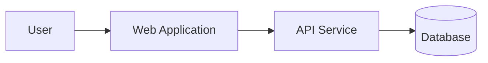

# Architecture_Diagram_Template

    ## 0. Metadata
    (See YAML header above)

    ## 1. Template Purpose
    Ensure consistent architectural visualization across ELAs.

    ## 2. When to Use This Template
    At all design and review checkpoints.

    ## 3. Prerequisites
    Architecture_Overview_Template.md.

    ## 4. Instructions
    Use C4 notation for system, container, component, and deployment diagrams.

    ## 5. Template Content Sections

### 5.1 Example C4 Container Diagram

    ## 6. Validation
    Architecture diagrams reviewed and approved by EAO.

    ## 7. Related Templates
    - Architecture_Overview_Template.md
- Deployment_Topology_Template.md