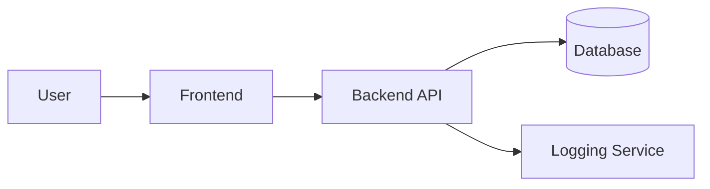

# DataFlow_Diagram_Template

    ## 0. Metadata
    (See YAML header above)

    ## 1. Template Purpose
    Model how data moves through the system to support integration and security design.

    ## 2. When to Use This Template
    Use during design workshops before development begins.

    ## 3. Prerequisites
    Architecture_Overview_Template.md and Requirements_Document.md.

    ## 4. Instructions
    Use Mermaid or Draw.io to visualize data movement across trust boundaries.

    ## 5. Template Content Sections

### 5.1 Example Data Flow Diagram

    ## 6. Validation
    Ensure all data stores classified using Data_Classification_Template.md.

    ## 7. Related Templates
    - Architecture_Overview_Template.md
- Data_Architecture_Template.md