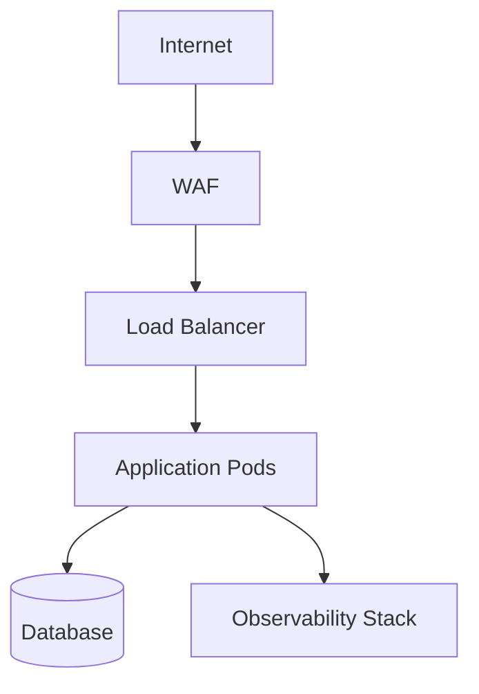

# Deployment_Topology_Template

    ## 0. Metadata
    (See YAML header above)

    ## 1. Template Purpose
    Ensure environment design supports scalability, security, and maintainability.

    ## 2. When to Use This Template
    Before infrastructure provisioning and CI/CD setup.

    ## 3. Prerequisites
    Infrastructure_Design_Template.md.

    ## 4. Instructions
    Map all environments and their connectivity; describe scaling strategies.

    ## 5. Template Content Sections

### 5.1 Deployment Diagram

    ## 6. Validation
    Confirm topology adheres to cloud security baselines.

    ## 7. Related Templates
    - Infrastructure_Design_Template.md
- Monitoring_Design_Template.md