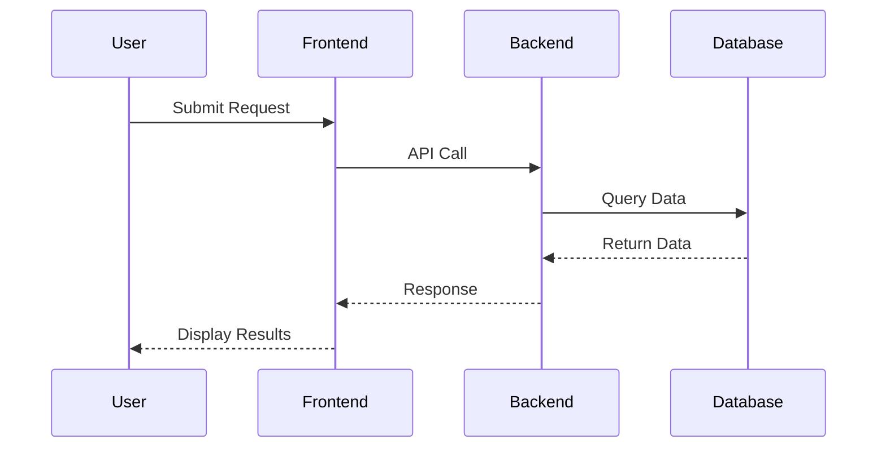

# Sequence_Diagram_Template

    ## 0. Metadata
    (See YAML header above)

    ## 1. Template Purpose
    Visualize time-ordered messages between components to verify logical flow.

    ## 2. When to Use This Template
    Used during solution design to confirm process integrity.

    ## 3. Prerequisites
    Architecture_Overview_Template.md.

    ## 4. Instructions
    Use Mermaid or PlantUML syntax for clarity; cover success and error paths.

    ## 5. Template Content Sections

### 5.1 Example Sequence Diagram

    ## 6. Validation
    Validate that sequence diagrams reflect all security and validation steps.

    ## 7. Related Templates
    - DataFlow_Diagram_Template.md
- Threat_Model_Template.md